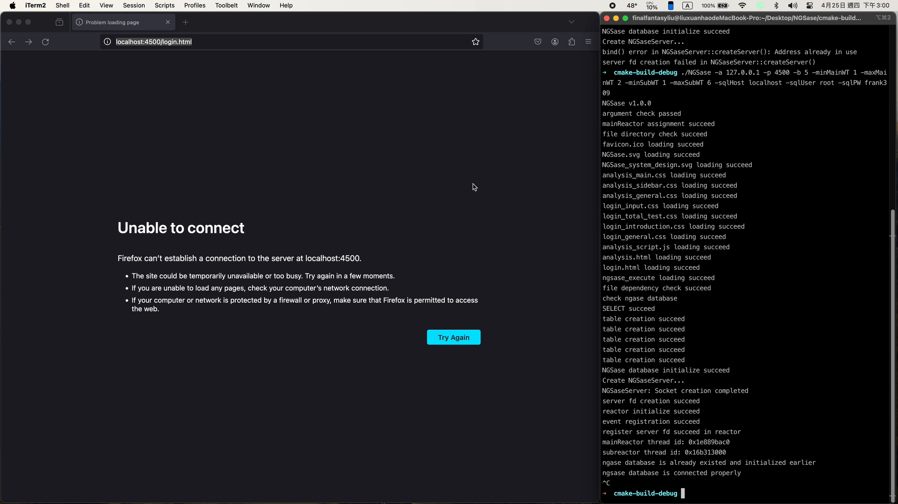

 
<a name="readme-top"></a>


<details open>
  <summary>Table of Contents</summary>
  <ol>
    <li>
      <a href="#about-the-project">About The Project</a>
      <ul>
        <li><a href="#built-with">Built With</a></li>
      </ul>
    </li>
    <li>
      <a href="#getting-started">Getting Started</a>
      <ul>
        <li><a href="#prerequisites">Prerequisites</a></li>
        <li><a href="#installation">Installation</a></li>
      </ul>
    </li>
    <li><a href="#usage">Usage</a></li>
    <li><a href="#contact">Contact</a></li>
  </ol>
</details>
<br />


# About the Project


The NGS analysis used to be intimidating and had a higher learning curve for "non-coding" persons. It is not easy for biologists who wish to engage in NGS analysis to gather powerful evidence from a gene perspective. Nowadays, practical and useful interactive NGS analysis interfaces are still controlled by biotech companies. Open-source analysis websites may even become archived or lack highly customized pipeline construction options. Therefore, young and inexperienced biologists or those passionate about biology may need to invest significant effort in learning coding or spend substantial amounts of money on NGS analysis.

NGSase is designed to provide a user-friendly and highly customized interface to its target audience.Here are three highlight features: 

- Users can easily combine various NGS tools to create their own pipelines.
- Each pipeline can be executed concurrently, enhancing efficiency.
- Users can effortlessly set up NGSase web servers for internal use.

**Furthermore, NGSase has a lightweight server architecture which is developed from scratch without using any existed web framework.**
<p align="right">(<a href="#readme-top">back to top</a>)</p>

## Built With

* 
* 
* 
* 
* 
<p align="right">(<a href="#readme-top">back to top</a>)</p>

# Getting Started

NGSase is currently supported only on MacOS and FreeBSD. Compatibility for other platforms will be considered in the near future.
## Prerequisites

The NGSase relies on various NGS analysis tools to construct a flexible pipeline for users. Currently, it is compatible with **fastp**, **cutadapt**, **kallisto**, and **subread**. These programs can be installed using **homebrew**, **bioconda**, or by manual installation. However, ensure that you can call these programs in your environment.  

**The following install tutorial is based on MacOS with ARM architecture**

### kallisto

```bash
#install kallisto
brew install kallisto
#check installation
kallisto
```

### fastp

```bash
#install fastp
brew install fastp
#check installation
fastp -h
```

### cutadapt

```bash
#install cutadapt
sudo apt install pipx python3-venv
pipx install cutadapt
#check installation
cutadapt --version
```

### subread

- Download program from official website of subread
[https://sourceforge.net/projects/subread/files/subread-2.0.6/](https://sourceforge.net/projects/subread/files/subread-2.0.6/)
- Please replace 'YourSubReadPath' with the destination path for Subread and add this command to your shell configuration file, such as .zshrc for Zsh or .bashrc for Bash
    
    ```bash
    export PATH="YourSubReadPath/bin:$PATH"
    ```
    

**Please ensure that MySQL is installed and an account has been created after installing NGS tools.**

```bash
brew install mysql
```
<p align="right">(<a href="#readme-top">back to top</a>)</p>

## Installation

1. Clone the repository
    
    ```bash
    git clone 
    ```
    
2. Ensure that these folders are located within the same directory as the NGSase binary file.
    
    ```mathematica
    - Directory
      |- executeFiles
      |- htmls
      |- icons
      |- scripts
      |- styles
      |- NGSase (Binary File)
    ```
    
3. Execute NGSase using commands within the cmake-build-debug or your designated build directory.
    
    ```mathematica
    ./NGSase -h
    ```
    
<p align="right">(<a href="#readme-top">back to top</a>)</p>

# Usage

- Please fill out all options after **`./NGSase`**. For example:
    
    ```bash
    ./NGSase -a 127.0.0.1 -p 4500 -b 5 -minMainWT 1 -maxMainWT 2 -minSubWT 1 -maxSubWT 6 -sqlHost localhost -sqlUser BIOLAB -sqlPW 1234567
    ```
    
    Replace the values with your specific configuration as needed.
    
    - **all options**
        
        ```bash
        NGSase v1.0.0
        -a             IPv4 address with dot-decimal format
        -p             port number
        -b             backlog number
        -minMainWT     Minimum number of MainReactor worker thread
        -maxMainWT     Maximum number of MainReactor worker thread
        -minSubWT      Minimum number of SubReactor worker thread
        -maxSubWT      Maximum number of SubReactor worker thread
        -sqlHost       Host Name of MySQL
        -sqlUser       User Name of MySQL
        -sqlPW         Password of MySQL
        -h             argument information
        ```
        
- Fill URL with your server configuration and combine with entry file for NGSase (login.html) in your browser. For example:
    
    ```bash
    http://127.0.0.1:4500/login.htmlFor
    ```
    
    
    

For more information, also see:

- [NGSase System Design](https://sharp-wandflower-7df.notion.site/NGSase-System-Design-41e93538f72448b18d8d8440da4ac045?pvs=4)

<p align="right">(<a href="#readme-top">back to top</a>)</p>

# Contact

### Frank Liu

- **Email**
    
    > b10247050@gmail.com
    r08633005@ntu.edu.tw
    >
<p align="right">(<a href="#readme-top">back to top</a>)</p>